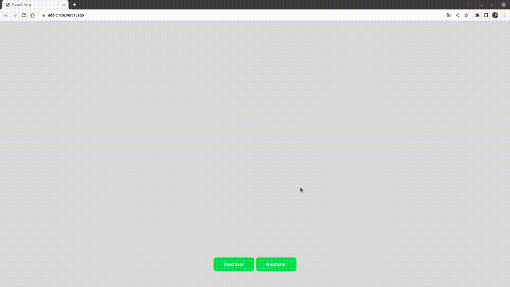

# ClickCircle

ClickCircle is a react application where each click generates a new circle on the screen



Try it out now at: https://click-circles.vercel.app/

## About

This application adds a circle at the exact position of your click, it also presents two buttons: <br>
- Undo: Undo the click that was added to the screen<br>
- Redo: Redo the click that was undone <br>

## Tecnologies

The following tools and frameworks were used in the construction of the project:<br>

   
    
    


## How to run

1. Clone this repository
2. Install dependencies

```bash
npm i
```

3. Run the front-end with

```bash
npm start
```

4. You can optionally build the project running

```bash
npm run build
```

5. Finally access http://localhost:3000 on your favorite browser
